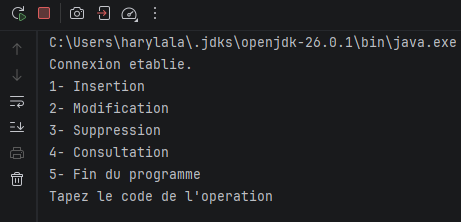

# TP Java avec MySQL

Ce dépôt contient le TP4 : connexion et manipulation d'une base de données MySQL (ajout, modification, suppression, consultation) depuis un programme Java simple.

## Captures d'écran
Placez vos captures dans le dossier `images/` et nommez-les comme ci-dessous pour qu'elles s'affichent correctement :

- `images/console.png` — sortie console (exécution de l'application)
- `images/phpmyadmin.png` — écran phpMyAdmin (création de la base)
- `images/table.png` — structure/ligne de la table `employe`

Exemple :



## Prérequis
- Java JDK installé
- IntelliJ IDEA (ou un autre IDE)
- Laragon (ou autre serveur MySQL) démarré et accessible

## Création de la base et de la table
Exécutez ces commandes dans phpMyAdmin ou un client SQL :

```sql
CREATE DATABASE IF NOT EXISTS tp4;
USE tp4;

CREATE TABLE IF NOT EXISTS employe (
  matricule INT PRIMARY KEY,
  nom VARCHAR(50) NOT NULL,
  prenom VARCHAR(50) NOT NULL,
  date_naissance VARCHAR(50) NOT NULL,
  ville VARCHAR(50) NOT NULL,
  salaire INT NOT NULL
);
```

## Lancer le TP

### Avec IntelliJ (recommandé)
1. Ouvrez le dossier du projet (`Test`) dans IntelliJ (doit contenir `pom.xml`).
2. Si IntelliJ propose d'**Importer les changements Maven**, acceptez. Sinon ouvrez **View → Tool Windows → Maven** et cliquez sur **Reload All Maven Projects**.
3. Vérifiez que Laragon/MySQL est démarré et que la base `tp4` existe.
4. Ouvrez `src/Main.java` et exécutez la classe `Main`.

### Sans Maven (ajout manuel du driver)
1. Téléchargez le driver MySQL (`mysql-connector-j`) depuis le site officiel.
2. Dans IntelliJ : **File → Project Structure → Modules → Dependencies → + → JARs or directories** et ajoutez le fichier `.jar`.
3. Exécutez `src/Main.java` depuis l'IDE.

## Notes utiles
- Le code lit la configuration de connexion depuis des propriétés système : `tp4.db.url`, `tp4.db.user`, `tp4.db.password`. Par défaut :
  - URL : `jdbc:mysql://localhost:3306/tp4?useSSL=false&serverTimezone=UTC`
  - utilisateur : `root`
  - mot de passe : vide
- Pour autoriser des valeurs contenant des espaces (ex. "Hary Lala"), le programme lit maintenant les champs avec `Scanner.nextLine()`.

## Où placer les captures
Créez un dossier `images` à la racine du projet et placez-y vos captures :

```
Test/
├─ src/
├─ images/
│  ├─ console.png
│  ├─ phpmyadmin.png
│  └─ table.png
├─ pom.xml
└─ README.md
```

Si tu veux, je peux ajouter les images pour toi si tu les uploades ici — je les copierai dans `images/` et mettrai à jour le README automatiquement.


